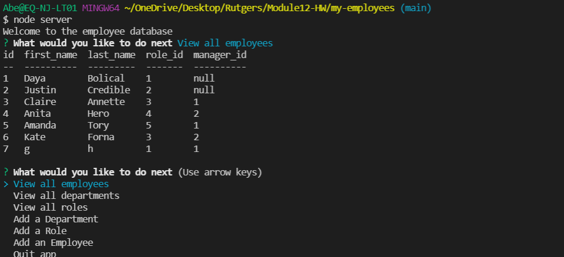

# My-Employees, A Employee Tracking App

## Description:

Using SQL database and the Command Line Interface, a user can keep track of their employees.

## Testing Instructions:

Running "Node Server" will bring up the command line interface. From the CLI, a user can view employees, department, roles - Create an employee, department, role, or edit an employee.

## Link to Walkthrough Video:

https://drive.google.com/file/d/1nSkKD_UubOtHJKJQBhXhcGGi8tKhwCwm/view

## Screenshot of App in use:

## Built With:

- Javascript
- Inquirer
- MySQL2
- Console.Table

## Contribution:

Made with ❤️ by Avrumie Safranovitz
Thank you to Jude Clark for the awesome drag name ideas!
